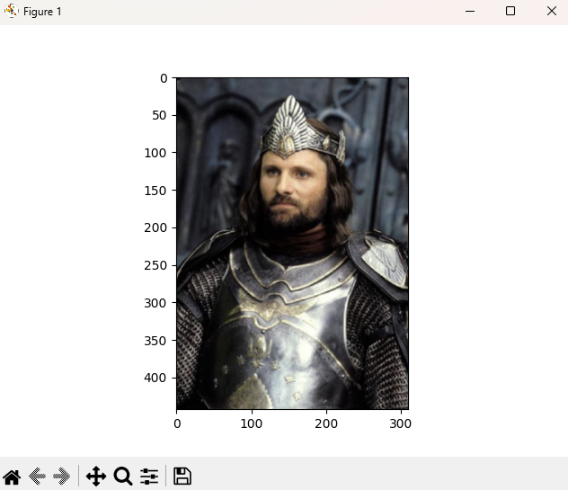

# 🖼️ Leitura e Exibição de Imagens com Python (OpenCV + Matplotlib)

Este repositório contém um exemplo simples e fundamental de leitura e visualização de imagens utilizando Python, OpenCV e Matplotlib.

O código faz parte das atividades da Pós-Graduação em Inteligência Artificial e Ciência de Dados da Universidade Anhembi Morumbi, no módulo:

📘 Módulo 01 — Engenharia, Preparação e Visualização de Dados  
➡️ Lição 03: Transformação e preparação de dados

---

## 🚀 Objetivo do Código

O objetivo deste script é demonstrar como:

- Ler uma imagem com a biblioteca OpenCV  
- Ajustar o formato de cores de BGR para RGB  
- Exibir a imagem usando Matplotlib  
- Introduzir conceitos iniciais de manipulação e visualização de dados visuais

Esse é um passo essencial na área de Engenharia de Dados, Visão Computacional e Pré-processamento de dados para Machine Learning.

---

## 🧩 Tecnologias Utilizadas

- Python 3 
- OpenCV (cv2) — leitura e manipulação de imagens  
- NumPy — operações matriciais  
- Matplotlib — exibição gráfica  

---

## 📁 Estrutura do Arquivo

```
code.py  
imagem.png  
README.md
```

---

## 📌 Código Utilizado

```
#Leitura de uma imagem
# Importar bibliotecas
import cv2
import numpy as np
import matplotlib.pyplot as plt
import matplotlib

# Leitura da imagem
img = cv2.imread('imagem.png')

# Apresentação da imagem na tela
plt.imshow(cv2.cvtColor(img, cv2.COLOR_BGR2RGB))
plt.show()
```

---

## 🧠 Como o Código Funciona

✔ 1. Importação das bibliotecas  
O script importa OpenCV, NumPy e Matplotlib, essenciais para lidar com imagens armazenadas como matrizes.

✔ 2. Leitura da imagem  
`cv2.imread()\` carrega o arquivo `imagem.png` para um array NumPy.

✔ 3. Conversão de BGR para RGB  
OpenCV trabalha com BGR, enquanto Matplotlib usa RGB.  
Por isso é necessária a conversão:

```
cv2.cvtColor(img, cv2.COLOR_BGR2RGB)
```

✔ 4. Exibição  
`plt.imshow()\` exibe a imagem, enquanto `plt.show()` abre a janela gráfica.

---



## 🛠️ Como Executar o Projeto

1. Instale as dependências:

```
pip install opencv-python matplotlib numpy
```

2. Coloque a imagem desejada na mesma pasta com o nome `imagem.png`.

3. Execute o script:

```
python code.py
```

---

## 📚 Aprendizados

- Como carregar imagens em Python  
- Como visualizar imagens com bibliotecas científicas  
- Como preparar dados visuais para análise  
- Primeiros passos para visão computacional e IA aplicada a imagens  

---


